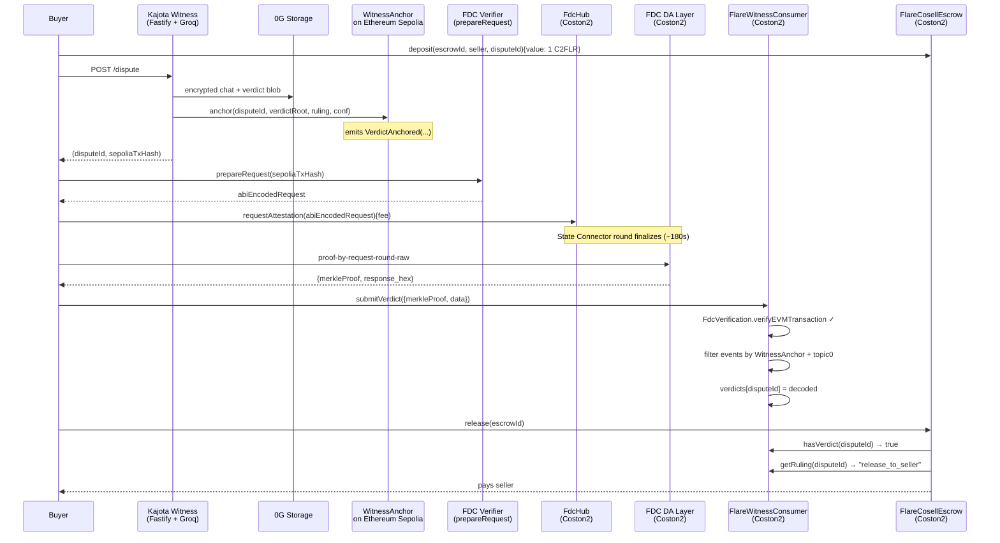

# Kajota Witness × Flare — cross-chain AI-jury verdicts via FDC

**Submission for [Flare Summer Signal](https://dorahacks.io/hackathon/flaresummersignal/detail) — Bounty 1: Interoperable Asset Products.**

> **Kajota Witness** (an AI dispute-jury for on-chain escrow) writes its verdicts to
> **0G Storage** and anchors their root on **Ethereum Sepolia**. This submission adds a
> **Flare-native trust layer** on Coston2: `FlareWitnessConsumer` uses **Flare Data
> Connector**'s `EVMTransaction` attestation to import Kajota verdicts on-chain,
> and `FlareCosellEscrow` releases funds only when a verdict has been FDC-verified.
> Remove FDC and the escrow cannot resolve — the Flare integration is load-bearing.

## Rule 0 pitch template

> `<recognizable pattern>` + `<Flare primitive>`
> = **AI-jury dispute resolution** + **FDC `EVMTransaction` cross-chain attestation**

Every escrow protocol needs a way to decide "who was right"; every cross-chain app
needs a way to trust the other chain. Both are known problems. Kajota Witness
already had a working answer for the first (a 3-LLM jury with encrypted evidence
on 0G Storage, shipped for 0G Zero Cup 2026). Flare's FDC is a working answer for
the second. Composing them produces something neither side had: a Flare-native
escrow that can settle on a Kajota jury's ruling with **no bridge, no multisig
oracle, and no need to trust Kajota's server**.

## Existed before this hackathon vs. new work

The Flare Summer Signal rules say submissions from existing projects must clearly
split what existed, what's new, what was ported, and why the new work matters.

### Existed before
- **Kajota Witness core** (repo `KaJota-inc/kajota-witness`, shipped Jun 22 2026 for 0G Zero Cup Round 1):
  - Encrypted memory blob writer + reader on 0G Storage
  - 3-LLM jury pipeline (Groq `llama-3.3-70b-versatile`) — deliberates, votes, writes verdict blob
  - `WitnessAnchor.sol` on 0G Galileo (`0x2f1D3a…cEC94`) — anchors verdict root hash + ruling + confidence + timestamp on-chain
  - Fastify API + single-page HTMX UI
- **Kajota Mesh** (repo `KaJota-inc/kajota-mesh`, shipped May 2026):
  - `CosellRegistry` + `CosellEscrow` on Ethereum Sepolia and Mantle Sepolia
  - Coach mobile app with Privy embedded wallet — the human end of a dispute

### Newly built during Flare Summer Signal
- [`contracts/flare/FlareWitnessConsumer.sol`](../contracts/flare/FlareWitnessConsumer.sol) — Coston2 contract that:
  1. Accepts an FDC `EVMTransaction` proof of a Sepolia `VerdictAnchored` event
  2. Calls `ContractRegistry.getFdcVerification().verifyEVMTransaction()` to validate the Merkle proof
  3. Filters events by our WitnessAnchor emitter address + `keccak256("VerdictAnchored(...)")` topic0
  4. Decodes the event's non-indexed data (`string, uint64, uint64, address`) with `abi.decode`
  5. Stores the imported verdict keyed by disputeId
- [`contracts/flare/FlareCosellEscrow.sol`](../contracts/flare/FlareCosellEscrow.sol) — Coston2-native escrow that gates `release()` on `consumer.hasVerdict(disputeId)`. Remove the FDC integration, `release()` reverts forever.
- [`scripts/flare/attest-verdict.ts`](../scripts/flare/attest-verdict.ts) — the end-to-end orchestrator:
  `prepareRequest` → on-chain `FdcHub.requestAttestation` (paid in C2FLR) → voting-round wait → DA-layer proof retrieval → on-chain `submitVerdict` on the consumer.
- [`scripts/flare/compile.ts`](../scripts/flare/compile.ts) — a lightweight `solc` compile utility with a custom `findImports` callback that resolves `@flarenetwork/flare-periphery-contracts/coston2/*` from `node_modules`, so we didn't have to graft Hardhat onto the existing ESM/tsx-based Witness toolchain.

### Ported to Flare
- `WitnessAnchor.sol` (existing) re-deployed to **Ethereum Sepolia**. Same bytecode, different chain. Reason: FDC's `EVMTransaction` supports source chains `testFLR`, `testETH` (Sepolia), `testSGB` — **not** 0G Galileo (chainId 16602). Sepolia is the closest FDC-attestable chain to Witness's existing 0G Galileo home, and Kajota's Mesh contracts are already on Sepolia, so the composition is natural.
- Existing anchor helper script kept for 0G Galileo (`scripts/deploy-anchor.ts`); a new sibling `scripts/flare/deploy-sepolia-anchor.ts` deploys the same source to Sepolia.

### Why this matters to Flare users / devs / ecosystem
- **A Flare-native app can now consume a Kajota AI-jury verdict without trusting Kajota's server or bridging state.** The trust root is the FDC voting round, not Kajota. This turns "AI-jury as a service" into a composable Flare primitive.
- **The FDC `EVMTransaction` attestation type is a great fit for cross-chain event-based state**, but there are few end-to-end reference implementations that decode a real emitter's event data and gate a real on-chain action on it. This submission ships one that works today on Coston2, with a real Sepolia counterpart contract.
- **The escrow composition is generalisable**: any Flare app that wants "release funds only if some off-Flare EVM event fired" can copy the consumer pattern and swap in their own event topic + emitter.

## Architecture



## Verified contracts

| Contract | Chain | Address | Purpose |
|---|---|---|---|
| `WitnessAnchor` | Ethereum Sepolia (11155111) | _filled by deploy-sepolia-anchor.ts_ | New Sepolia deploy of the existing anchor. |
| `FlareWitnessConsumer` | Flare Coston2 (114) | _filled by deploy-coston2.ts_ | Consumes FDC EVMTransaction proofs of Sepolia anchors. |
| `FlareCosellEscrow` | Flare Coston2 (114) | _filled by deploy-coston2.ts_ | Native C2FLR escrow gated by the FDC-imported verdict. |
| `FlareContractRegistry` | Flare Coston2 (114) | `0xaD67FE66660Fb8dFE9d6b1b4240d8650e30F6019` | Canonical Flare registry (looked up at runtime). |

_Live proof txs added below after Coston2 dry-run._

| Step | Tx | Explorer |
|---|---|---|
| Sepolia anchor (`WitnessAnchor.anchor`) | _pending_ | sepolia.etherscan.io |
| Coston2 `FdcHub.requestAttestation` | _pending_ | coston2-explorer.flare.network |
| Coston2 `FlareWitnessConsumer.submitVerdict` | _pending_ | coston2-explorer.flare.network |
| Coston2 `FlareCosellEscrow.release` | _pending_ | coston2-explorer.flare.network |

## Constraints we hit and how we solved them

Real engineering scars from this port — the sponsor-primitive "hard parts" appendix.

| # | Constraint | Where it bit | How we solved it |
|---|---|---|---|
| 1 | **FDC EVMTransaction source-chain whitelist** doesn't include 0G Galileo — only `testFLR`, `testETH` (Sepolia), `testSGB`. | Original Witness anchor lives on 0G Galileo. Naive port would have been unattestable. | Redeploy `WitnessAnchor.sol` to Ethereum Sepolia (same bytecode) and let FDC attest Sepolia txs. Kept the 0G Galileo anchor live for the original Witness product. |
| 2 | **solc "Stack too deep"** inside `submitVerdict` — the FDC `Proof` struct's nested fields plus `abi.decode` locals blow past solc's 16-slot stack limit. | `contracts/flare/FlareWitnessConsumer.sol:95` — the emit block. | Enabled `viaIR: true` in the compile pipeline. Refactoring to fewer locals would have added runtime cost; the IR pipeline is the right knob. |
| 3 | **ContractRegistry lookup pattern** — the FDC contract addresses on Coston2 aren't a compile-time constant and Flare rotates them. | Naive `address constant FDC_HUB = …` would break on rotation. | Both the on-chain consumer (`ContractRegistry.getFdcVerification()`) and the off-chain orchestrator (`getContractAddressByName('FdcHub')`) look everything up through the immutable `FlareContractRegistry` at `0xaD67FE6…6019`. |
| 4 | **Event data decoding** — the WitnessAnchor `VerdictAnchored` event uses two indexed topics + non-indexed `(string, uint64, uint64, address)`, and FDC returns raw ABI-encoded bytes. | `abi.decode(ev.data, (string, uint64, uint64, address))` in the consumer. | Explicit topic0 constant computed at compile time from the exact event signature. Emitter-address gating **before** decoding, so a spoofed same-topic event from another contract can't corrupt state. |
| 5 | **ESM/tsx vs Hardhat toolchain drag** — Witness runs on `type: "module"` + tsx, but Flare's example contracts use Hardhat. | Would have doubled the toolchain. | Wrote a 60-line `scripts/flare/compile.ts` that gives raw `solc` a `findImports` callback resolving `@flarenetwork/flare-periphery-contracts/coston2/*` from `node_modules`. Zero Hardhat. |
| 6 | **Voting-round timing race** — `FdcHub.requestAttestation` returns a tx, and the round finalizes ~2 epochs later; naive `sleep(180000)` overshoots on early requests and undershoots on late ones. | `scripts/flare/attest-verdict.ts:waitForFinalization`. | Compute the target timestamp from `FIRST_VOTING_ROUND_START_TS + (round + 2) * 90` and poll the Coston2 block timestamp, sleeping the min of 30s and remaining. Idempotent on repeat retries. |

## How to reproduce the demo

Prerequisites: Node 20+, a funded Coston2 wallet (`https://faucet.flare.network/coston2`),
a funded Sepolia wallet (any faucet), a Flare testnet verifier API key.

```bash
git clone -b hackathon/flare-summer-signal https://github.com/KaJota-inc/kajota-witness
cd kajota-witness && npm install
cp .env.example .env  # fill SEPOLIA_RPC_URL, WITNESS_DEPLOYER_PK, VERIFIER_API_KEY_TESTNET

# 1. Deploy the existing WitnessAnchor to Sepolia
npx tsx scripts/flare/deploy-sepolia-anchor.ts

# 2. Deploy the Flare consumer + escrow to Coston2
npx tsx scripts/flare/deploy-coston2.ts

# 3. Produce a fresh anchor event on Sepolia (skip if using a real dispute flow)
npx tsx scripts/flare/anchor-on-sepolia.ts \
  --dispute 0x$(openssl rand -hex 32) \
  --root 0x$(openssl rand -hex 32) \
  --ruling release_to_seller --conf 8700

# 4. Attest that anchor tx into Coston2 via FDC
npx tsx scripts/flare/attest-verdict.ts <sepolia-tx-hash-from-step-3>

# 5. Deposit into the Flare escrow bound to that disputeId, then release()
#    (see docs/FLARE-DEMO.md for the ethers snippet)
```

## Judging rubric map

| Criterion | Where to look |
|---|---|
| **Product usefulness** | Any Flare app that needs off-Flare event-based settlement (escrow, insurance payout, subscription cutover) can copy `FlareWitnessConsumer` and swap the emitter/topic. Kajota's own Mesh escrow benefits directly. |
| **Flare integration quality** | Load-bearing use of `FdcVerification` + `ContractRegistry` + `IEVMTransaction`. Not a checkbox — remove FDC and `FlareCosellEscrow.release` reverts forever. |
| **Technical execution** | Contracts compile cleanly (viaIR + optimizer), consumer gates emitter address before decoding, orchestrator computes voting round from block timestamp (not `Date.now()`), and retries the DA layer with a bounded backoff. |
| **Evidence of new work** | The "Existed before / Newly built / Ported / Why" split above. Newly built = 2 Solidity contracts + 3 TS scripts + 1 compile utility. |
| **Clarity + future potential** | Single-file marketing README. Diagram, verified contract table, hard-parts table, reproducible demo. Roadmap: generalise the consumer to accept an arbitrary `(emitter, topic0, decode template)` tuple so it becomes a reusable Flare adapter for any cross-chain event. |

## Composed with

Following the "name the specific artifact you compose with" pattern from the
hackathon playbook — this submission composes with:

- **`@flarenetwork/flare-periphery-contracts@^1`** — `ContractRegistry`, `IEVMTransaction`, `IFdcVerification` on the `coston2/` path.
- **`FlareContractRegistry`** at `0xaD67FE66660Fb8dFE9d6b1b4240d8650e30F6019` on Coston2.
- **FDC verifier** at `https://fdc-verifiers-testnet.flare.network` — `EVMTransaction/prepareRequest` on the `eth` (Sepolia) source.
- **Coston2 Data Availability Layer** at `https://ctn2-data-availability.flare.network` — `proof-by-request-round-raw` for round-scoped proofs.
- **`KaJota-inc/kajota-witness@main`** `WitnessAnchor.sol` — the source of truth for verdict events on Sepolia.
- **`ethers@^6`** for signing, `solc@^0.8.35` for viaIR compilation.
